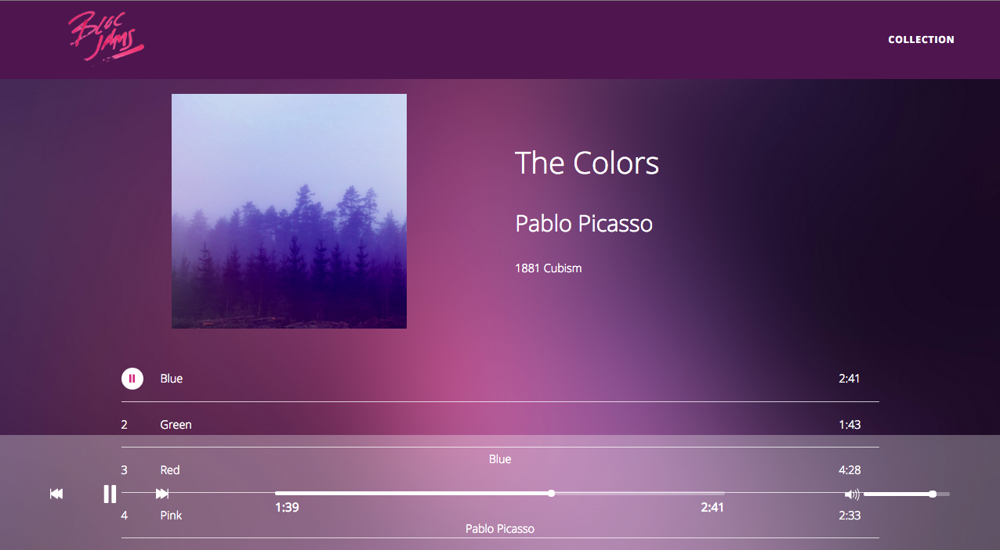

## Bloc Jams - Angular

A starter application for student projects in Bloc's [Frontend Web Development Course](https://www.bloc.io/frontend-development-bootcamp).



## Configuration

Start by cloning the repository:

```
$ git clone https://github.com/tdreitz/bloc-jams-angular.git <your-frontend-project-name>
```

The project uses Grunt to run tasks in development. Install the project dependencies by running:

```
$ npm install
```

## Run the Application

Run the application using the Gruntfile's `default` task:

```
$ grunt
```

The default task runs a simple server on port 3000. To view it in a any browser, go to [http://localhost:3000](http://localhost:3000).

## Directory Structure

```
├── Gruntfile.js
├── LICENSE
├── .gitignore
├── Procfile
├── README.md
├── app
│   ├── assets
│   │   └── images
│   │   └── music    
│   ├── pages
│   │   └── index.html
│   ├── scripts
│   │   └── app.js
│   │   └── fixtures.js
│   ├── styles
│   │   └── album.css
│   │   └── collection.css
│   │   └── landing.css
│   │   └── main.css
│   │   └── normalize.css
│   │   └── player_bar.css
│   └── templates
│   │   └── album.html
│   │   └── collection.html
│   │   └── landing.html
│   │   └── main.html
│   │   └── normalize.html
│   │   └── player_bar.html
├── package.json
└── server.js
```

All code, styles, markup, and assets should be saved to the `app` directory. Saving changes creates a new directory, `dist`, that holds final copies of the application content. `dist` is the directory the server uses to serve the content displayed by the browser. __Do not edit files in `dist`__ because it will reset changes to your work every time you save. Restrict all edits to files in the `app` directory.

### Assets/Images

Add images to the `app/assets/images` directory. 

To reference any other assets, like the music in Bloc Jams, use the path `assets/<asset-type>/<asset-file>`. The Gruntfile is pre-configured to handle assets in a subfolder with the `.mp3` extension.

>See lines 14 and 35 of `Gruntfile.js` for the accepted file extensions of assets.

### Difference between Pages and Templates

The `templates` directory should hold any HTML files used as templates in Angular states configured by UI Router. All other HTML files belong in the `pages` directory.

### Procfile

The `Procfile` is a file for [providing instructions to Heroku servers](https://devcenter.heroku.com/articles/procfile) that run after pushing new code to the repository. __Do not change the contents of the Procfile__ or Heroku will throw an error when you attempt to visit your application.

>For more information about how to use Heroku with Bloc's frontend applications, see our [resource on using Heroku](https://www.bloc.io/resources/using-heroku-frontend).

## Grunt plugins

A list of the Grunt plugins in this application.

#### Watch

[Grunt watch](https://github.com/gruntjs/grunt-contrib-watch) watches for changes to file content and then executes Grunt tasks when a change is detected.

#### Copy

[Grunt copy](https://github.com/gruntjs/grunt-contrib-copy) copies files from our development folders and puts them in the folder that will be served with the frontend of your application.

#### Clean

[Grunt clean](https://github.com/gruntjs/grunt-contrib-clean) "cleans" or removes all files in your distribution folder (`dist`) so that logic in your stylesheets, templates, or scripts isn't accidentally overridden by previous code in the directory.

#### Hapi

[Grunt Hapi](https://github.com/athieriot/grunt-hapi) runs a server using [`HapiJS`](http://hapijs.com/). Happy is a Node web application framework with robust configuration options.
